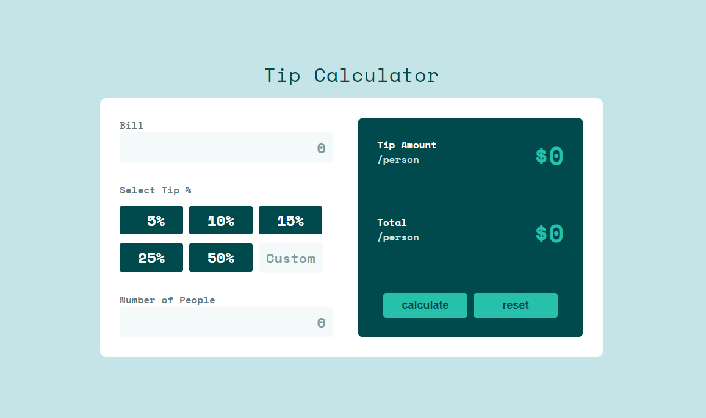

# Tip Calculator

- View project Live : (https://singular-gnome-cb3b8f.netlify.app/)

# Step Guide :

- Step 1: Create the HTML file
  First, you'll need to create an HTML file using a text editor. This file is where you'll write the code that will create the structure and content of your web page. It could have something like input fields where you can enter the amount and percentage of tip.

- Step 2: Add styling with CSS
  Once you have the basic structure of your HTML file set up, you can use CSS to make your web page look nice. CSS is what you use to style web pages, so you can make your input fields look pretty, change the font or background color, or add containers to make things neatly organized.

- Step 3: Write JavaScript code
  Add a script tag to include JavaScript in your HTML file. Then write the code that calculates the tip and total amount. Use event listeners to detect when a user clicks a button and fetches the values entered in the input fields to perform the calculation. Finally, display the results on the page.

- Step 4: Test and debug
  Finally, test your tip calculator and make sure it works the way it's supposed to. Try entering different values and see if the calculated total is correct. Debug any errors that may come up.

# design guide :

i used frontendmentor website tip calculator app design you can make your own style and design or use this

- website : (https://www.frontendmentor.io/challenges/tip-calculator-app-ugJNGbJUX)
