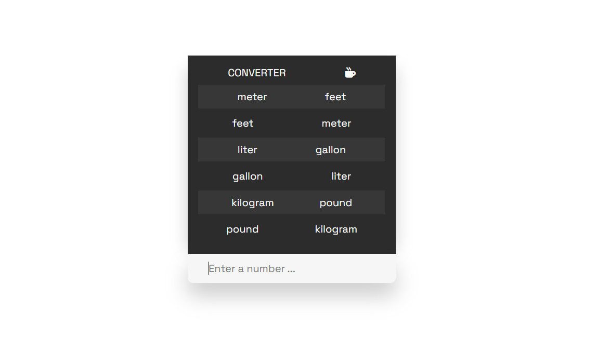

# Unit Converter

- View project Live : (https://dreamy-licorice-d81e17.netlify.app/)

# Step Guide :

- Step 1 : Create a new HTML file and add the necessary structure for the app, including the input field and the output sections for the different units.

- Step 2 : Create a CSS file and add styles for the different sections of the app, including the input field and the output sections for the different units.

- Step 3 : Create a JavaScript file and add a function that will convert the input value from one unit to another for each different unit category (length, volume, and mass).

- Step 4 : Use the getElementById() method to get the input field and the output sections for each unit category.

- Step 5 : Add an oninput event listener to the input field that will call the conversion function when the user types a number.

- Step 6 : Use the computed values from the conversion function to update the text of the output sections for each unit category.

- Step 7 : Add a check for NaN values in the input field, and clear the output sections if the input is not a number.

- Step 8 : Test the app by inputting different numbers and checking the output values for each unit category.

# design guide :

i used dribbble website for unit-converter app design

- website : (https://dribbble.com/shots/19973856-Unit-Converter-Figma-Plugin)