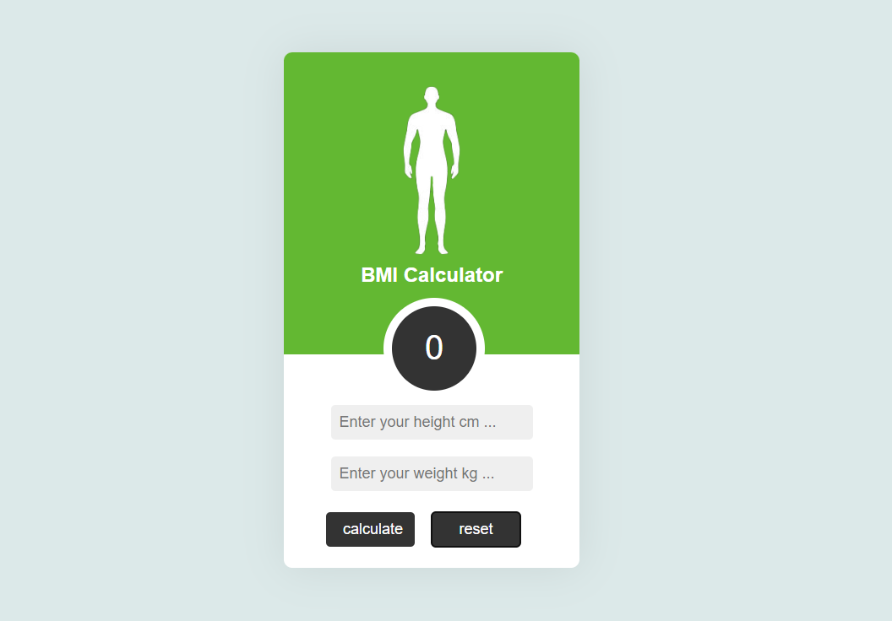

# BMI Calculator

- View project Live : (https://grand-paletas-953d5e.netlify.app/)

# Step Guide :

- Step 1 :Create a new HTML file and add the necessary tags and attributes.

- Step 2 :Inside the HTML file, add a container div and other divs for the elements of the calculator, such as the input fields, buttons, and result display.

- Step 3 :Add CSS styles to the elements to make them visually appealing.

- Step 4 :Create an array of objects in JavaScript to store the data for the different body shapes.

- Step 5 :Use the getElementById() method to get the necessary HTML elements into JavaScript variables.

- Step 6 :Create a calculateBMI() function that extracts the values of height and weight input fields, calculates the BMI using the formula (weight / (height * height)), and displays the result to the user.

- Step 7 :Inside the calculateBMI() function, use conditional statements to determine the body shape of the user based on their BMI value and update the display with the corresponding data.

- Step 8 :Create a rest() function that resets the display and clears the input fields.

- Step 9 :Add event listeners to the calculator buttons to execute the functions when clicked.

- Step 10 :Test the calculator and adjust the styles and functionality until satisfied.

# design guide :

i used dribbble website for bmi calculator app design

- website : (https://dribbble.com/shots/1026112-BMI-Calculator)