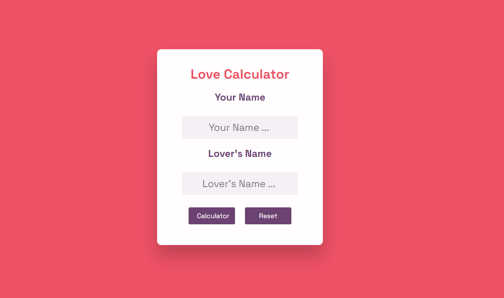

# Love Calculator

- View project Live : (https://candid-malabi-0b1523.netlify.app/)

# Step Guide :

- Step 1 : Create a new HTML file and add the basic structure including head and body tags.

- Step 2 : Create a container div for the calculator and add headings to it.

- Step 3 : Create two input forms and label them as 'Your Name' and 'Lover's Name' respectively.

- Step 4 : Create two buttons labelled 'Calculate' and 'Reset'.

- Step 5 : Add an ID to each input form for easy reference in the JavaScript code.

- Step 6 : Add an event listener to the 'Calculate' button that calls a function to start the calculation.

- Step 7 : Create a function that accepts the input values, checks if both inputs are filled, and calculates a random number.

- Step 8 : Create a function that displays the calculated percentage starting from 0% and increments it by one until it reaches the calculated percentage.

- Step 9 : Add a time delay between each increment using the setTimeout() method to create an animation-like effect.

- Step 10 : Stop the counting when it reaches the calculated percentage.

- Step 11 : Add an event listener to the 'Reset' button that clears all input values and result values.

- Step 12 : Create a CSS file and style the calculator container, headings, input forms and buttons.

- Step 13 : Add color styles and animation effects to make the calculator visually appealing.

- Step 14 : Test the calculator and make necessary adjustments to achieve the desired functionality and look.

